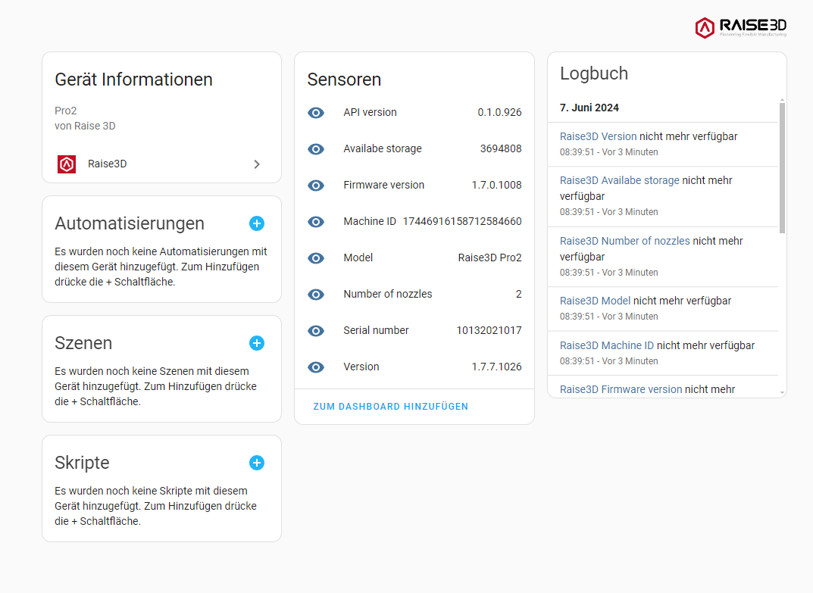

# Raise3D Integration for Home Assistant

Home Assistant integration `raise3d` for Raise3D printers does use the Raise3D API to 
communicate locally with such. This is not an official integration by Raise3D.

## Installation

Copy the content of the 'custom_components' folder to your home-assistant folder 'config/custom_components' or install through HACS.
After reboot of Home-Assistant, this integration can be configured through the integration setup UI

Click here to install over HACS:

## Enable the API

