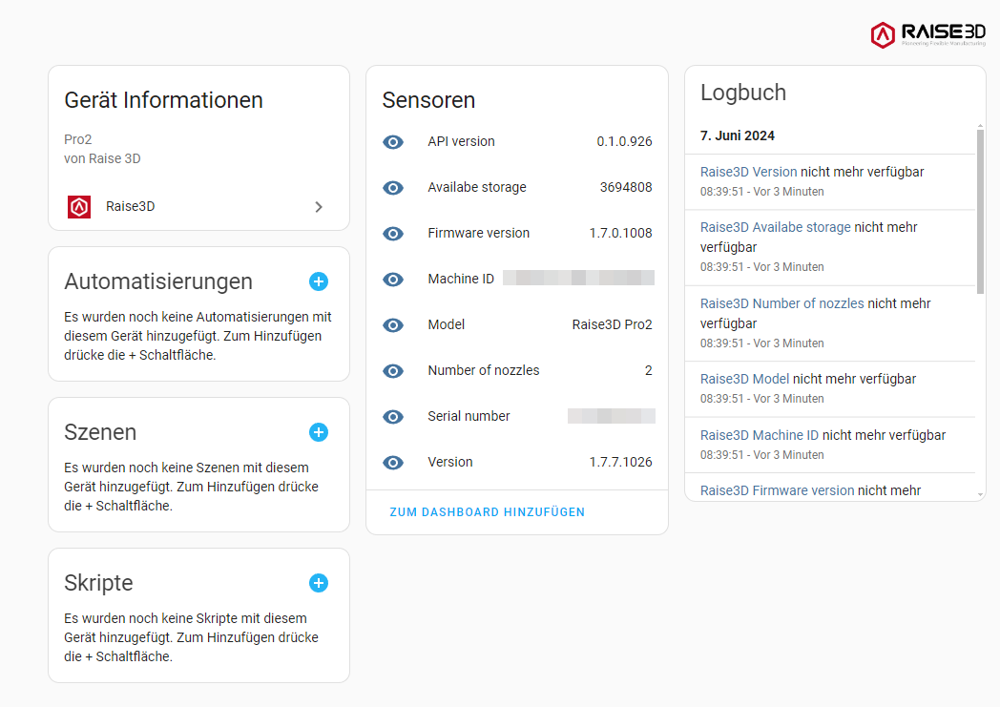

# Raise3D Integration for Home Assistant

Home Assistant integration `raise3d` for Raise3D printers does use the Raise3D API to
communicate locally with such devices.

This is not an official integration by Raise3D.

## Installation

Copy the content of the 'custom_components' folder to your home-assistant folder 'config/custom_components' or install through HACS.
After reboot of Home-Assistant, this integration can be configured through the integration setup UI

Click here to install over HACS:

## Raise3D API

Raise3d provides an API which allows to interface to the printer via http.
It returns printers data (parameter) in a JSON format.

You can browse the API documentation by visiting http://xxx.xxx.xxx.xxx:10800 (on behalf of the printer IP address)
to see how to use the API. A copy of mine is stored [here][doc/] (download html and api_files folder)

The Raise3D API is deactivated by default, and it's a little bit tricky to activate it. However, it can be
switched on via the printers touch display. To do this, simply tap on the cogwheel symbol in top right corner and follow
this step-by-step instruction.

### Secure Password (1st step)

   Go to the menu entry **Machine > More Settings > Privacy and Security** and tap on **Secure Settings**

   Click on the switch **Secure Settings and Secure password**

   A new window will pop up and you need to tap on the eye symbol to see the secure password. Please write down this password

   

### Enable API (2nd step)

   Go to the menu entry **Machine > Developer** and tap on **Enable Remote Access API** if it is not enabled yet

   A new window will be displayed. Please enter the secure password from step 1. If the correct password is entered
   a **Secure password verification** is displayed. Please tap on next. Then a message is displayed that the API is enabled.

   

### Access password (3rd step)

	Go to the menu entry **Machine > Developer > Access password**

	A new window will pop up and you need to tap on the eye symbol to see the secure password. Please write down this password

	

## Printer connection setup

In oder to exchange data between Home Assistant and the printer,
it is necessary to configure the HACS component corresponding configuration parameter when adding a new device.

The following Information must be provided

* The Name of the device: Please name the device as you like
* URL or IP Address: In general you need to put in here the device IP of the printer in your local network. A URL should be fine as well.
* Port configuration: The standard port is **10800**
* printer password: Put in the [**Access password**](#Access-password)
* Polling Frequency: This parameter defines how often new data will be polled from the device. The default value is 30s.
